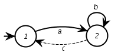
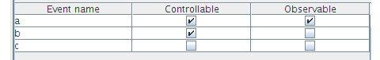
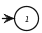
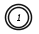
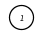
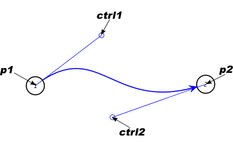

# IDES 2.1 File Format

There are two types of files in the IDES filesystem. One has the extention .xmd
and contains informations regarding DES models, the other has extention .xwd
and regards sets of DES models called workspaces.

The two types will be explained in the subsequent sections.

## Model representation

The XML data in a IDES file, must conform to the following DTD:
```
<!ELEMENT model (data,meta*>
<!ATTLIST version #REQUIRED, type #REQUIRED, id #REQUIRED>

<!ELEMENT data(state*,event*,transition*)>

<!ELEMENT meta(ANY)>
<!ATTLIST tag #REQUIRED, version #REQUIRED>
```

Although it can support representation for multiple kinds of discrete event systems,
IDES has a default support for finite states automata (from now on called FSA in this text).

The implementation of the file format for a FSA  is as described by the following
Document Type Definition (DTD):
```
<!ELEMENT model (data*,meta*)>
<!ATTLIST version #REQUIRED, type #REQUIRED, id #REQUIRED>

<!ELEMENT data(state*,event*,transition*)>

<!ELEMENT meta(font, state*,transition*)>
<!ATTLIST tag #REQUIRED, version #REQUIRED>

<!ELEMENT state (name,properties,ANY)>
<!ATTLIST state id ID #REQUIRED>

<!ELEMENT event (name,properties,ANY)>
<!ATTLIST event id ID #REQUIRED>

<!ELEMENT transition ANY>
<!ATTLIST transition id ID #REQUIRED
                      source IDREF #REQUIRED
                      target IDREF #REQUIRED
                      event IDREF #IMPLIED
                      group #CDATA>

<!ELEMENT name (#PCDATA)>

<!ELEMENT properties (initial?,marked?,
                       observable?,controllable?,ANY)>
<!ELEMENT initial       EMPTY>
<!ELEMENT marked        EMPTY>
<!ELEMENT observable    EMPTY>
<!ELEMENT controllable  EMPTY>

<!ELEMENT circle EMPTY>
<!ATTLIST circle x CDATA #REQUIRED
                  y CDATA #REQUIRED
                  r CDATA #REQUIRED>

<!ELEMENT bezier EMPTY>
<!ATTLIST bezier x1 CDATA #REQUIRED
                y1 CDATA #REQUIRED
                ctrlx1 CDATA #REQUIRED
                ctrly1 CDATA #REQUIRED
                ctrlx2 CDATA #REQUIRED
                ctrly2 CDATA #REQUIRED
                x2 CDATA #REQUIRED
                y2 CDATA #REQUIRED>

<!ELEMENT arrow EMPTY>
<!ATTLIST arrow x CDATA #REQUIRED
                y CDATA #REQUIRED>

<!ELEMENT label EMPTY>
<!ATTLIST label x CDATA #REQUIRED
                y CDATA #REQUIRED
                group CDATA #IMPLIED>
```

Consider a simple FSA model, with two states and three transitions (Figure 1).

----------



_Figure 1._ A simple model created using IDES

----------

The layout of some graph elements like edges and nodes, can be modified at
the user's will though it does never reflect on the structure of the model.

All the information regarding only the structure of the model itself is named "data",
all the rest is named "metadata". As metadata one can refer to information regarding
the visual representation of a graph or even binary-data that may be needed to be stored,
representing some aspect of a model.

### Detailed description of a model file

As said before, the file that represents models in IDES are xml structured files
that has .xmd as extention. The first line of such a file tells information about
xml version and character encoding.

A file that displays a  model like the one shown in the figure 1 was created
using the version 2.1 of IDES and has as the first line the following information:
```
<?xml version="1.0" encoding="UTF-8"?>
```
* The attribute `version` indicates the XML version used.
* The attribute `encoding` indicates the encoding of the file. It must be UTF-8.

### The model field

At the second line starts the model field that contains information about
the version of IDES under which the model was created,
it also has informations about the DES type and an "id" for the model.

Every file **must** have the model field.
```
<model version="2.1" type="FSA" id="model">
```
* The attribute `version` indicates the version of the file format.
* The attribute `type` indicates the type of DES system represented by the model.
Currently, only "FSA" is supported.
* The attribute `id` is mandatory but deprecated. Its value is not used.

----------

**NOTE:**
_Future development of IDES may introduce DES models different from "FSA"._
_Any software processing IDES files must check to see what is the content of the "type" attribute._

----------


### The data field

The field with the word "data" as a tag  is the minimal set of informations
needed to represent a DES model, it does not hold any informations about,
for example, visual representation of a model.
A model must have just one occurrence of such a field.

The tag `<data>` does not have any attributes.
The data field, according to the xml convention starts with the opening tag
`<data>` and finishes when the file hits the enclosing `</data>`.
As for a FSA model, the data field contains three internal fields:
state, event and transition.

Example of the data field for the FSA model shown in Figure 1:
```
<data> 
	<state id="1"> 
		<properties> 
			<initial /> 
		</properties> 
		<name>1</name> 
	</state> 
	<state id="2"> 
		<properties> 
			<marked /> 
		</properties> 
		<name>2</name> 
	</state> 
	<event id="1"> 
		<properties> 
			<controllable /> 
			<observable /> 
		</properties> 
		<name>a</name> 
	</event> 
	<event id="2"> 
		<properties> 
			<controllable /> 
		</properties> 
		<name>b</name> 
	</event> 
	<event id="3"> 
		<properties /> 
		<name>c</name> 
	</event> 
	<transition id="1" source="1" target="2" event="1"> 
	</transition> 
	<transition id="2" source="2" target="1" event="3"> 
	</transition> 
	<transition id="3" source="2" target="2" event="2"> 
	</transition>
</data> 
```
As one can see, there are three different tags inside the data field.

* `<state>` contains the mandatory attribute `id` which represents internally the state.
There can be many of these tags in a FSA model file but all ids have to be unique.
There are, for an FSA, two internal tags for a state: `<properties>` and `<name>`.
    * `<properties>` holds aditional information needed to fully represents a state.
    At the moment this document was written, the supported properties
    for a state were "initial" or "marked". The `<properties>` tag is mandatory
    and has to be present even if a state is neither marked nor initial.
    Its simpler form would be the self-enclosing: `<properties/>` for such a state.
    In the example, there are two states in the model. Both are either initial or marked.
    The currently supported properties for a state in FSA models,
    are `<initial/>` and `<marked/>`.
    The possible fields describing the properties of a state are:
        1. An initial state :
        ```
            <properties>
                <initial/>
            </properties>
        ```
        2. A marked state :
        ```
            <properties>
                <marked/>
            </properties>
        ```
        3. An initial and marked state :
        ```
            <properties>
                <initial/>
                <marked/>
            </properties>
        ```
        4. A conventional state :
        ```
            <properties/>
        ```
    * `<name>` has the text which appears as a label for the state.
* `<event>` contains the usual (and mandatory) property `id` that internally identifies
the event. There are, for an FSA, two mandatory tags for `<event>`: `properties` and `name`.
There can be many `event` tags in a FSA model file but all ids have to be unique.
    * `<properties>` there are currently two supported properties for an event:
    `<controllable/>` and `<observable/>`. The possible fields describing
    the properties of an event are:  
        1. A controllable event:
        ```
            <properties>
                <controllable/>
            </properties>
        ```
        2. An observable event:
        ```
            <properties>
                <observable/>
            </properties>
        ```
        3. A controllable and observable event:
        ```
            <properties>
                <controllable/>
                <observable/>
            </properties>
        ```
        4. A non-controllable and non-observable event:
        ```
            <properties/>
        ```
    * `<name>` contains the name of the event.
* `<transition>` this tag has four attributes and no internal tags.
The properties are: `id`, `source`, `target` and `event`.
There can be many of these tags in a FSA model file but all ids have to be unique.
    * `id` is an unique internal representation for a transition.
    * `source` points to the id of the source state of a transition.
    * `target` points to the id of the target state of a transition.
    * `event` points to the event that triggers the transition.
    This attribute is not mandatory. If it is missing,
    no event will be assigned to the transition. Example:
    ```
        <transition id="3" source="2" target="2" event="2">
    ```

### The meta field

There can be **many** meta fields inside a file, the meta field must contain all the information that does not belong to the minimal set of information necessary to represent a DES model. 
As for the type of data that can be stored inside a meta field, it can vary from regular XML structures, to binary data. Any relevant information can be stored between `<meta>` and `</meta>`. Each `<meta>` filed must have two attributes:
* The attribute `tag` indicates the type of data stored in the meta section.
* The attribute `version` indicates the version of the format in the meta section.

----------

**NOTE:**
_"Meta" sections are entirely optional. IDES will load a model file without any "meta" sections._
_Furthermore, there can be multiple "meta" sections in a single file as long as_
_they have unique "tag" attributes. These sections are not guaranteed to contain valid XML data_
_(for example, they may contain binary data). Any software processing IDES files must be_
_able to handle any number of  "meta" sections and has to check to see what is the content_
_of the "tag" attributes to determine if a given section is of interest._

----------

In the current implementation of IDES, only a single `meta` section is saved in the file.
It is the section describing the graphical layout of the FSA model and the `tag` attribute is "layout".
_Layout information may be missing if the FSA model is very large and has never been laid out._

The model used as example contains the following metadata field:
```
<meta tag="layout" version="2.1">
	<font size="12"/>
	<layout uniformnodes="false"/>

	<state id="1">
		<circle r="18.0" x="69.0" y="91.0" />
		<arrow x="36.0" y="0.0" />
	</state>
	<state id="2">
		<circle r="18.0" x="217.0" y="92.0" />
		<arrow x="1.0" y="0.0" />
	</state>
	<transition id="1">
		<bezier x1="69.0" y1="91.0" x2="217.0" y2="92.0" ctrlx1="111.89058685302734" ctrly1="66.62200927734375" ctrlx2="174.4427490234375" ctrly2="67.0446548461914" />
		<label x="5.0" y="5.0" />
	</transition>
	<transition id="2">
		<bezier x1="217.0" y1="92.0" x2="69.0" y2="91.0" ctrlx1="174.10940551757812" ctrly1="116.37799072265625" ctrlx2="111.5572509765625" ctrly2="115.9553451538086" />
		<label x="5.0" y="5.0" />
	</transition>
	<transition id="3">
		<bezier x1="217.0" y1="92.0" x2="217.0" y2="92.0" ctrlx1="166.08831787109375" ctrly1="41.088314056396484" ctrlx2="267.91168212890625" ctrly2="41.088314056396484" />
		<label x="-3.0" y="-17.0" />
	</transition>
</meta>
```
* `<font>` specifies the font size to be used in the model.
At this time IDES does not support font sizes, so this field is not interpreted.
* `<layout>` contains the attribute `uniformnodes` which can be "true" or "false".
If it is "true", all nodes in the graph will have the same size
(the maximum node size in the model). This option is settable by the user in the interface.
* `<state>` contains the elements needed for a conventional visual description of a state.
The mandatory attribute `id` is there to identify the state being represented.
There must be exactly one of these tags for each state described in the `<data>` field.
There are, for an FSA, two internal tags for a state: `<arrow>` and `<circle>`.
    * `<circle>` contains the location of a state-representation in a graph.
    It follows the common computer graphics convention of having the pair (x,y) = (0,0)
    at the top-left side of the screen. This tag also contains the radius of the node.
        * `r` is the radius of the node.
        * `x` is the x coordinate of the node in the graph.
        * `y` is the y coordinate of the node in the graph.
    * `<arrow>` contains the coordinates for the directional vector that tells
    the direction of the initial arrow. This tag is required for every state, however,
    it is only used when the arrow belongs to the representation of an initial state.
    It contains two mandatory attributes which give the angle at which the arrow approaches the node.
        * `x` is the x coordinate of the vector of approach (assuming that the centre of the node is 0,0).
        * `y` is the y coordinate of the vector of approach (assuming that the centre of the node is 0,0).
* `<transition>` contains information about visual representation of a transition.
It contains the mandatory attributes `id`, and `group`. 
    * `id` which points to the represented transition.
    * `group` is an optional numeric value that is used when more than one transition is
    to be represented in the graph, by the same edge. All transitions with the same group number
    will be shown as a single edge (with multiple events in the label).  
A transition contains two sub-tags, `<label>` and `<bezier>`:
    * `<label>` contains information about location of a label containing
    the name of an event (or the group of events if transitions are grouped)
    in the graph. It contains two attributes, `x` and `y`.
        * `x` is the x coordinate of the label in the graph.
        * `y` is the y coordinate of the label in the graph.
    * `<bezier>` contains the information needed to represent an edge as a bezier curve.
    A bezier curve contains 4 points, so this tag contains 8 attributes
    (corresponding to the coordinates of the control points, as shown in the figure)
    and no subtags.      
    
        * `x1`, the x coordinate for the point p1 in the graph.
        * `y1`, the y coordinate for the point p1 in the graph.
        * `x2`, the x coordinate for the point p2 in the graph.
        * `y1`, the y coordinate for the point p2 in the graph.
        * `ctrlx1`, the x coordinate for the point ctrl1 in the graph.
        * `ctrly1`, the y coordinate for the point ctrl1 in the graph.
        * `ctrlx2`, the x coordinate for the point ctrl2 in the graph.
        * `ctrly2`, the y coordinate for the point ctrl2 in the graph.

## Workpace representation

As said before, files with the extention xwd represent a set of DES files
and is defined according to the following DTD:
```
<!ELEMENT workspace (model*) >
<!ATTLIST version #REQUIRED>

<!ELEMENT model EMPTY>
<!ATTLIST file #REQUIRED, position #REQUIRED, selection #IMPLIED>
```

### Detailed description of a workspace file

A simple example of a workspace file with two models is given in the following box:
```
<?xml version="1.0" encoding="UTF-8"?> 
<workspace version="2.1"> 
	<model file="model.xmd" position="0" selected="true"/> 
	<model file="model2.xmd" position="1"/> 
</workspace>
```
* `<workspace>` contains the mandatory attribute version which indicates
the version of IDES that has built the file.
    * `version` is the mandatory attribute that contains the
    version of IDES in which the file was created.
* `<model>` contains three mandatory attributes and no subfields.
It has information about the files containing the DES models present in the workspace.
    * `file` contains a path (in relation to the workspace file) for a model file.
    * `position` tells the position of the model in a sequence of models.
    (In IDES the position is related to where, in the filmstrip, a model is shown).
    * `selected`, it can be "true" or "false" and indicates which model is selected
    when the workspace is loaded. When omitted, it is assumed to be "false".
    Only one model can have this attribute set to "true".
