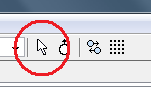
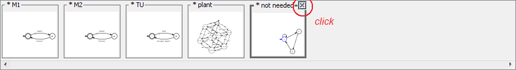

Modelling with IDES
======================

Guided tutorial
---------------

In this tutorial you will learn how to use IDES to model and solve
Discrete-Event System (DES) problems within the Ramadge & Wonham framework
\[Ramadge, P. J. and W. M. Wonham: 1987, 'Supervisory control of a class of
discrete event processes'. SIAM Journal on Control and Optimization 25(1), 206–230\].

This tutorial will guide you through a simple DES problem based on the
"Transfer line" problem [Al-Jaar and Desrochers, 1988] often used
in DES literature as an example. The models and features of the problem
that are required for the tutorial will be reproduced below.

Before starting the tutorial, make sure that you have installed Java 8 (or greater)
and IDES. You can obtain Java from [(here)](https://adoptopenjdk.net/)
and IDES from [(here)](https://github.com/krudie/IDES).
In case you would like to use LaTeX labels inside IDES, you also need to set up
LaTeX on your computer. To do so, refer to the instructions in the IDES Help menu
or on the
[IDES website](https://github.com/krudie/IDES/blob/master/docs/help/LaTeX%20Rendering/index.md).
Please note that LaTeX will not be necessary for this tutorial.

How to start IDES
--------------------

On most systems you can start IDES by double-clicking on the "IDES-version.jar"
file in the folder where you put the IDES files.

1. Open the folder where IDES is located.
2. Double-click on the IDES-version.jar file.

If Java is installed on your system properly, this should work in most cases.

In case IDES does not start by double-clicking the file, it is also possible
to start the program through the command line.

1. Start the command line.
2. Navigate to the folder where IDES is located.
3. Execute `java -jar IDES-version.jar`

If IDES does not start, make sure that Java 8 or greater is installed
correctly on your system.

IDES interface
--------------

  

Problem
-------

In this tutorial you will learn how to use IDES by solving a DES problem
based on the "Transfer line" problem [Al-Jaar and Desrochers, 1988]
often used in DES literature as an example.
The description of the problem follows.

There is a factory that needs to be controlled. A diagram of the factory is
displayed above. There are two machines, M1 and M2, which process parts.
M1 takes a part from an input bin and delivers it to a 3-slot buffer, B1.
M2 picks up a part from B1 and when it is done processing, delivers it
to a 1-slot buffer, B2. At the end of the processing line there is a testing unit,
TU, which takes a part from B2 and tests if it meets the quality standards.
If the test is positive, the part is delivered to an output bin. Otherwise,
the part is delivered to B1 for reprocessing by M2. There is a microcontroller
in each of M1, M2 and TU which can control when a part is picked up for processing
by the machine/testing unit. However, once the part is taken, the rest of
the process is automatic and there is no control over when and if the part
is delivered to its destination (buffer or output).

Produce a supervisory control solution which guarantees that the buffers
do not overflow or underflow.

Modelling
---------

### Machine 1

First, start by modelling Machine 1.
At the end, the model should look like the one shown next.

Modelling is done by activating the "_Create_" tool.

In order to make the first node, click with the mouse on empty space.

Next, you will create the outgoing edge and the second node simultaneously.
Click on the first node and move the mouse toward the place where you would
like to place the second node. Observe how the arrow of a new edge follows
the mouse cursor.

Click on empty space again to create the second node and link it with
an edge at the same time.

To make a transition back to the first node, you can either

1. click on the second node and then click on the first node

or

2. press down the mouse button on the second node, drag the cursor
to the first node, and then release the mouse button.

Observe how the edges curve their shapes so they do not overlap.

After all nodes and edges are created, activate the "_Select_" tool.

You can change the shape of an edge manually by clicking on the edge
and then dragging the two small handles (circles) until the curve forms
the desired shape. Undesired modifications can be undone by selecting "_Undo_".

You can reposition nodes by dragging them with the mouse cursor.

  

To make the first node initial and marked, right-click on the node
and select "_Initial_" and "_Marked_" from the pop-up menu.

To rename each node, double-click on the node or select "_Label_"
from the pop-up menu for the node. Enter the desired label in the dialog box
and press "Enter" on the keyboard or simply click outside the dialog to close it.
If you would like to cancel the renaming, press "Escape" on the keyboard.

Events can be assigned to an edge by double-clicking the edge or by selecting
"_Label_" from the pop-up menu for the edge (right-click an edge to access the pop-up menu).

Double-click the edge leading from the first node to the second node.
In the dialog, enter "start" as the event name. Make sure that the event is
"controllable" and "observable". Then, either click the "_Assign new_"
button and then "_OK_", or simply click "_OK_".

The edge becomes labelled with the "start" event and the event gets added
to the list of events in the "_Events_" tab.

You can reposition the label by dragging it with the mouse cursor to
the desired location.

Events can be managed in the "_Events_" tab on the right. You can create
the "finish" event in this tab. Simply enter the event name in the
"_Add new event_" field, make sure that it is "observable" but not "controllable",
and click the "_Add_" button. The event gets added to the list of events in the model.

To assign the finish event to the second edge, double-click the edge. In the dialog,
you will notice that both the "start" and "finish" events appear in the list
of available events for the edge. Either double-click on the "finish" event,
or select it and click on the "_\>>_" button to assign it. Notice that the event moved
to the list of assigned events. Click on "_OK_" to confirm the new assignment.

The two events are now assigned to the corresponding edges. Observe that
the edge with a controllable event has a little marker denoting that
this transition can be disabled. You can distinguish between controllable
and uncontrollable edges by the presence or absence of this mark.

In case you made a mistake in setting the controllability of events,
you can correct it by using the checkboxes in the "_Events_" tab.

The model of Machine 1 is almost complete. As it is necessary to differentiate
between the events in Machine 1 and Machine 2, rename the events in Machine 1
to "**start1**" and "**finish1**". To do so, double-click on each event name
in the "_Events_" tab and change the name. After changing a name, press "Enter"
on the keyboard and observe how the event name change propagates to
the graphical model automatically.

### Machine 2

You need to create a new model for Machine 2. Select "_New model_" from
the "_File_" menu or click on the corresponding icon in the toolbar.
In the dialog box, select "_Finite Sate Automaton_" and click "_OK_".

A new blank model appears on the screen. Observe that the "filmstrip"
in the bottom of the window now contains two thumbnails:
one of the Machine 1 model and one of the newly created model.

To rename the new model, double-click on the name of the model in the thumbnail,
or select "_Rename model_" from the "_Edit_" menu.

The model of Machine 2 is very similar to Machine 1. The only difference is that
the events are called "start2" and "finish2".

If you experience difficulties in creating the model, refer to
the instructions for the model of Machine 1.

### Testing unit

Start by opening a new model for the testing unit.

The model of the testing unit is very similar to the models of the two machines.

The new feature in this model is that there are two outcomes of
the testing operation. The testing unit can either accept or reject a part.
You can either create two separate edges going from the second node to
the first node, or you could assign two events to a single edge.

To assign the two events, "accept" and "reject", to a single edge,
first create the nodes and the edges as shown below. Then, follow this procedure:

1. Double-click on the edge going from the second node to the first.
2. In the dialog, enter the event "accept" and click the "_Assign new_" button.
The dialog will remain open.
3. Then, enter the event "reject" and click the "_Assign new_" button again.
Now both events will appear in the list of assigned events.
4. Finally, click "_OK_" to confirm your assignment.

In case you made a mistake, you can use the "_Undo_" function.
Controllability of events can be changed in the "_Events_" tab.

### Composing the plant

After all components of the plant are ready, they have to be composed
to form the model of the complete plant. To this effect,
select "_DES operations_" from the "_Operations_" menu.

In the dialog box, there are three sections. In the following figure,
the dialog box is shown when the "supcon" operation is selected.

On the left, there is a list of available **operations**.
When an operation is selected, its description appears below the list.

In the middle, there is space to select the **inputs** for the operation.
Some operations, such as "supcon", accept a specific number of inputs.
You can select the model for each input by using drop-down lists. Other operations,
such as "product", can accept multiple inputs. You can select the inputs
from a list of models. Hold down the "Control" key on the keyboard while
clicking with the mouse to select multiple models.

On the right, there are fields to name the models **output** by the operation,
if any. Operations such as "subset" do not output any models.

To compose the subcomponents of the plant, select the "sync" operation.
Then, as inputs, select the models for Machines 1 and 2 and for the Testing unit.
To select all of them, hold down the "Control" key on the keyboard while
clicking with the mouse. On the right, you can name the output by
typing in the name field (e.g. "plant").

Click on the "_Compute_" button in the bottom of the dialog and wait until
the filmstrip shows the newly computed model. On a slower computer,
this may take some time as the output has to be laid out. Then, close the dialog.

The plant, the synchronous composition of the subcomponents,
will be the new active model in the "filmstrip".

The automatic layout of the model may be suboptimal and it may
require manual adjustment. You can move nodes and edge labels by dragging them
with the mouse cursor. Edges can be reshaped by selecting them and dragging
the handles which appear (small circles).

Each computed model is annotated by the invoked operation. You can view and
modify the annotations under the "_Annotations_" tab.

To switch to a different model currently open in IDES, click on its icon
in the "filmstrip" in the bottom of the main window. To close a model
no longer needed, click on the "x" icon which appears in the top-right corner
of the thumbnail when you pass the mouse over the thumbnail.

At this point, you have finished modelling the plant. Next, you will model
the control specifications. It is necessary to specify limits on the operation
of the plant such that the two buffers do not underflow or overflow.

Buffer 1
--------

Buffer 1 can hold a maximum of 3 parts. Thus, it has four states (0 to 3 parts).
Machine 1 and the Testing unit can deposit parts into the buffer,
while Machine 2 can remove parts. All irrelevant events, such as
the Testing unit picking up a part from the second buffer, do not change the state
of the buffer. Thus, they should appear as self-looped transitions in all states.
The model for the Buffer 1 specification is shown next.

Open a new model for the specification and model it in the same way
as you modelled the components of the plant.

Self-looped edges can be created by starting an edge from a node and moving
the mouse cursor back to the same node, or by selecting "_Add self-loop_"
from the pop-up menu for the node (right-click for the pop-up menu).

Assigning events to self-loops works in the same way as with regular edges.
You can move or resize self-loops by selecting them and dragging their
handle (small circle).

When you are done, make sure that you included all events used in
the plant and that the event names are spelled correctly. If you need
to change an event name, double-click the name in the "_Events_" tab,
correct it, and press the "Enter" key on the keyboard.

The controllability of events is determined by their controllability
settings in the plant. Thus, whether events are controllable or uncontrollable
in the specifications is irrelevant for the final solution.

### Buffer 2

The model of Buffer 2 is similar to Buffer 1, however, it is simpler.
The buffer can contain a maximum of one part, so it has only two states.

In this case, we will use the "selfloop" operation to speed-up
the creation of the self-loops. After you are done with the basic model
(without the self-loops), go to the DES operations dialog.

Select the "selfloop" operation and choose the Buffer 2 model as the first input.
Then, from the list, select the events which you would like to self-loop
(all events except "finish2" and "test"). The events from the same models
are grouped together in a similar-colored blocks.

Click on the "_Compute_" button and then close the dialog.
You will notice that the selected events appear on self-loops in all nodes.

You can close the original model for Buffer 2 (without the self-loops)
by clicking on the "x" icon in the top-right corner of its thumbnail.
This icon appears when you move the cursor over the thumbnail.

You are done with the models of the specifications. Now it is possible
to compute either a modular or centralized supervisory solution.
In this tutorial, a centralized solution will be computed.

### Composing the specifications

To compose the specifications for Buffers 1 and 2, go to the "_DES operations_"
dialog and select the "product" operation. Select the Buffer 1 and Buffer 2
models as inputs. You can enter a name for the output (e.g., "specs").

Click the "_Compute_" button and close the dialog.

The controllability of the specifications with respect to the plant can be
verified by using the "controllable" operation. In this problem, the specification
is not controllable with respect to the plant.

Computing the supervisor
------------------------

The last step in solving this problem involves the computation of
the supervisor for the system. This can be achieved by using the "supcon"
operation in the "_DES operations_" dialog. Select the appropriate inputs
and click on the "_Compute_" button.

The correct solution has 28 states and 65 transitions. The number of states
and transitions in a model are shown in the status bar in the bottom of the main window.
If there are multiple events assigned to a single edge, each event counts
as a separate transition.

**Congratulations! You completed this tutorial. You were introduced to the main features of IDES.**