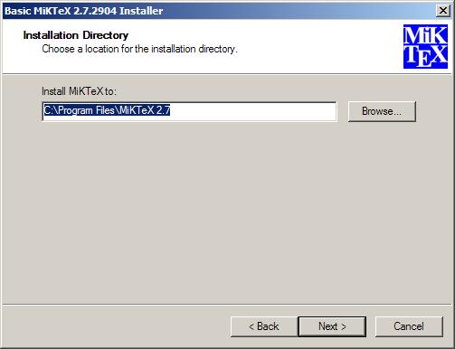
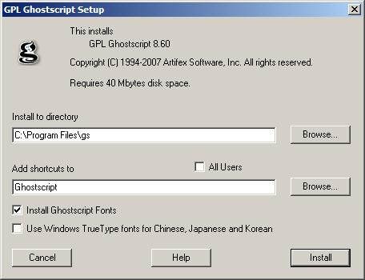
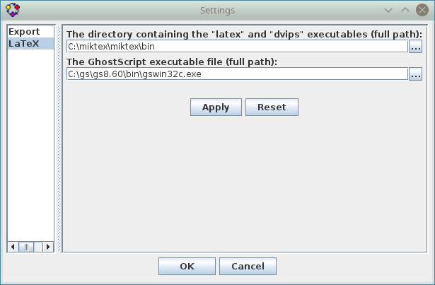

# Getting LaTeX Rendering to Work

The following instructions describe how to set up LaTeX rendering on Windows.
For other operating systems, the same corresponding steps can be used.

## LaTeX

A LaTeX distribution for Windows can be downloaded [here](https://miktex.org/).

The MiKTeX installer will ask for the installation directory. It is important to record
this because when you use the LaTeX option in IDES, you will need to specify
a subdirectory of this path. We suggest copying and pasting this directory into a text editor.

## GhostScript

GhostScript can be downloaded [here](https://www.ghostscript.com/).
Make sure to select the file that is compatible with your operating system.

Remember to record the installation directory because you will need one of the files
in the installation path for LaTeX rendering.

## Setup in IDES

For IDES to create LaTeX labels, it needs access to the LaTeX compilation files `latex` and `dvips`.
These should be in the "bin" subdirectory of the LaTeX installation directory
(possibly `C:\texmf\miktex\bin` on Windows or `/usr/bin` on Linux).
If not, perform a search of the installation path and you'll find them.

IDES also uses GhostScript to render the label and thus needs the location of the executable
file `gswin32c.exe` for Windows (**not** `gswin32.exe`) or `gs` for Linux.
Again, these files should be in the "bin" subdirectory of the installation path
(this may be `C:\gs\gs8.xx\bin\gswin32c.exe` on Windows or `/usr/bin/gs` on Linux).

Once you have the paths (directory for LaTeX, file for GhostScript),
go to the **Options** menu and select *More Options*.

You'll be presented with the dialog shown above. Enter the paths into the appropriate
text boxes (or select them using the "..." button to bring up a File dialog).
The only things left to do is select the *Use LaTeX* option from the **Options** menu and enjoy!
